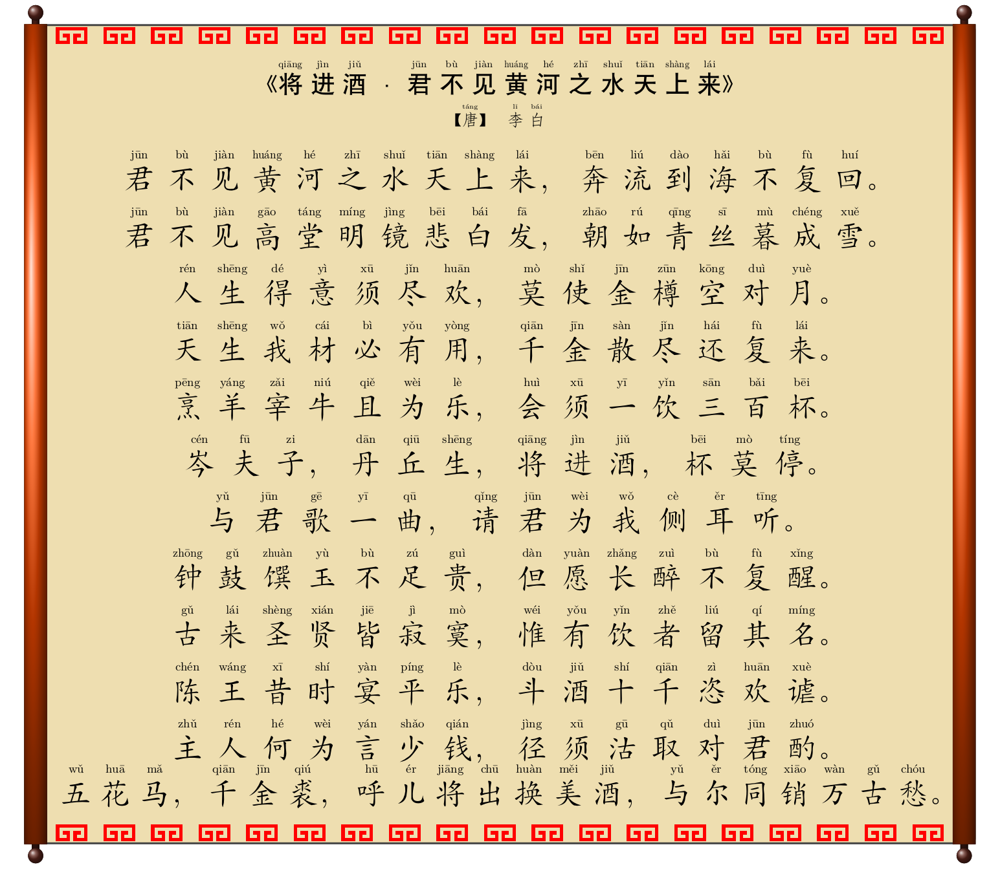
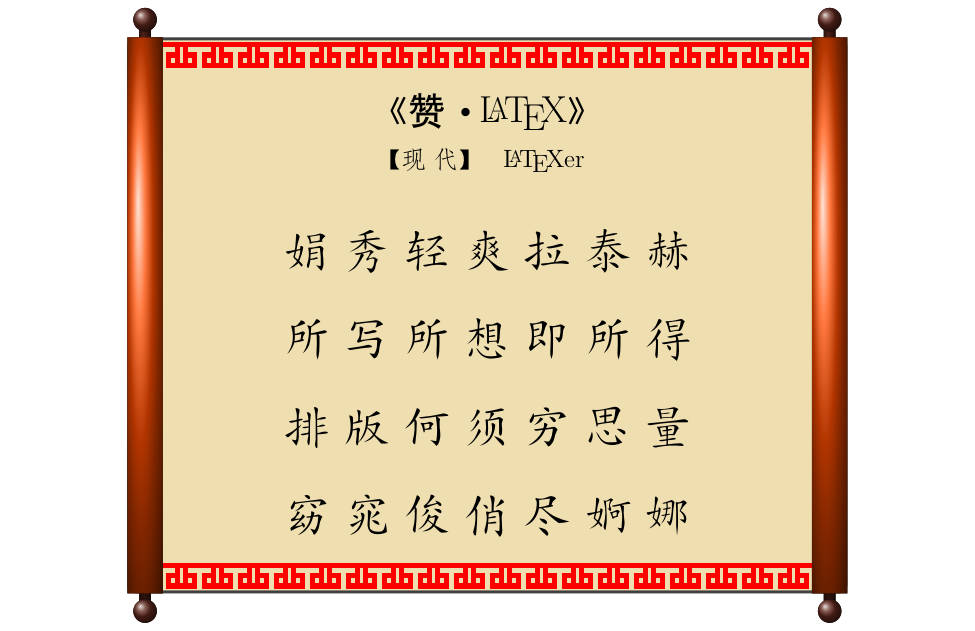
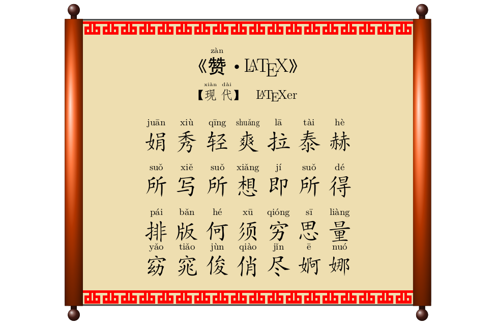

# poempdfhan
该项目基于来自LaTeX技术交流2群(478023327)网友"上海-TJAD-Chennanzhang"源代码改编的汉风图纹卷轴诗词排版宏包。

该宏包采用tcolorbox彩色盒子宏包，通过装饰汉风图纹实现。

Happy LaTeXing！~

注意：

1. 本文档要求 TeXLive、MacTeX、MikTeX 不低于 2019 年的发行版，并且尽可能升级到最新。

3. **不支持** [CTeX 套装](http://www.ctex.org/CTeXDownload)。

### 使用说明

1. 既可以在各类IDE中执行用XeLaTeX命令编译，可以在当前目录的命令行执行：make 命令进行编译
2. 在当前目录的命令行执行：make clean可以清理中间过程文件
3. 编译结果是PDF文件，请使用合适的软件进行查看。

### 排版样例
1. 

2. 

3. 

4. 

### 反馈问题

如果发现代码有问题，请按照以下步骤操作：

1. 将 TeX 发行版和宏包升级到最新，并且将模板升级到 Github 上最新版本，
查看问题是否已经修复；
2. 在 [GitHub Issues](https://github.com/registor/poempdfhan/issues)
中搜索该问题的关键词；
3. 在 [GitHub Issues](https://github.com/registor/poempdfhan/issues)
中提出新 issue，并回答以下问题：
    - 使用了什么版本的 TeX Live / MacTeX / MikTeX ？
    - 具体的问题是什么？
    - 正确的结果应该是什么样的？
    - 是否应该附上相关源码或者截图？
4. 联系作者：西北农林科技大学信息工程学院耿楠
